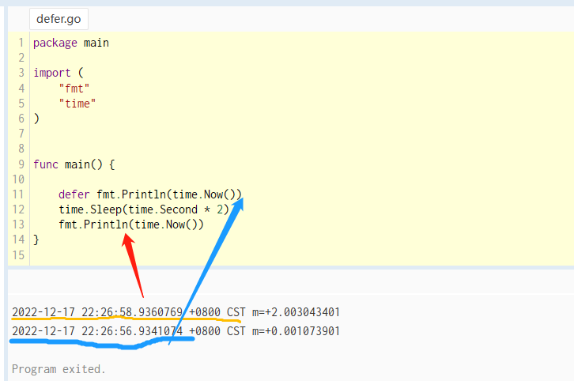
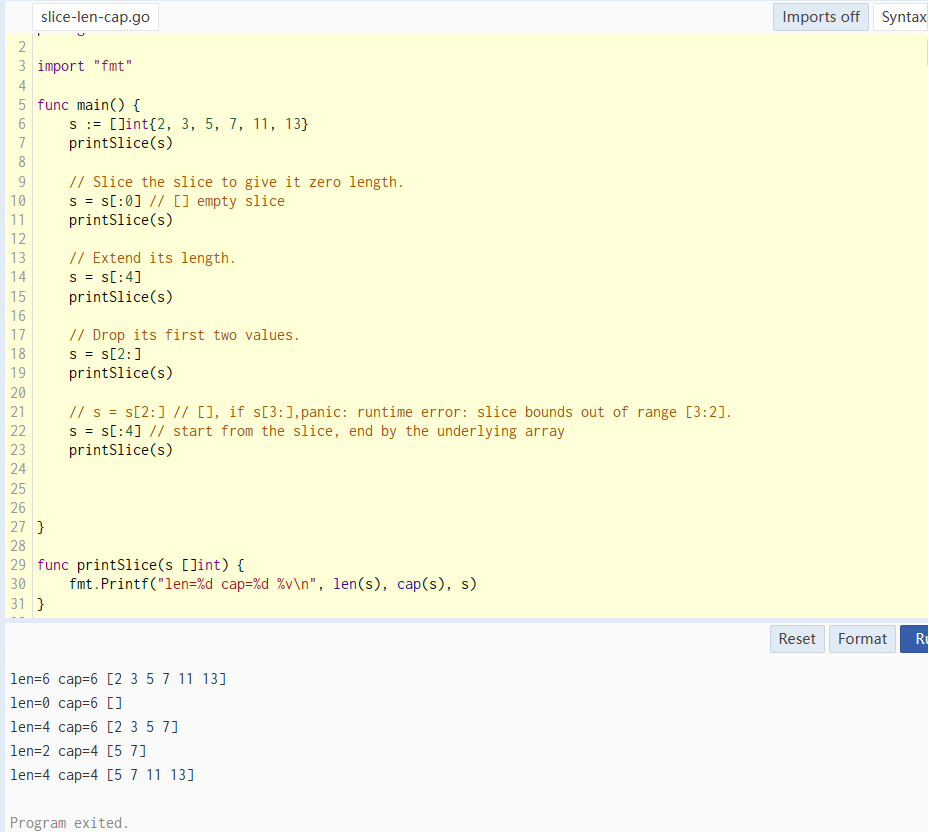

Exported names

In Go, a name is exported if it begins with a capital letter. For example, Pizza is an exported name, as is Pi, which is exported from the math package.

Funtions

```
func add(x int, y int) int {
    return x + y
}
```

When two or more consecutive named function parameters share a type, you can omit the type from all but the last. In this example, we shortened `x int, y int` to `x, y int`.


Functions: Multiple results

A function can return any number of results. The `swap` function returns two strings.

```
func swap(x, y string) (string, string) {
    return y, x
}
```

Functions: Named return values

Go's return values may be named. If so, they are treated as variables defined at the top of the function. These names should be used to document the meaning of the return values.

A return statement without arguments returns the named return values. This is known as a "naked" return.

Naked return statements should be used only in short functions, as with the example shown here. They can harm readability in longer functions.

```
func slit(sum int) (x, y int) {
    x = sum * 4 / 9
    y = sum - x
    return
}
```

Variables

The `var` statement declares a list of variables; as in function argument list, the type is last. A `var` statement can be at package or function level. We see both in this example.

```
package main

import "fmt"

var c, python, java bool

func main() {
    var i int
    fmt.Println(i, c, python, java)
}

```

Variables: variables with initializers

A var declaration can include initializers, one per variable. If an initializer is present, the type can omitted; the variable will take the type of the initializer.
```
package main

import "fmt"

var i, j int = 1, 2 // var i, j = 1, 2
func main() {
    var c, python, java = true, false, "no!"
    fmt.Println(c, python, java)
}
```

Variables: short variable declarations

Inside a function, the `:=` short assignment statement can be used in place of a `var` declaration with implicit type.

Outside a function, every statement begins  with a keyword (`var`, `func`, and so on) and so the `:=` construct is not available.

```
func main() {
    var i, j int = 1, 2
    k := 3 // inside a function level
    c, python, java := true, false, "no!" // inside a function level
    fmt.Println(i, j, k, c, python, java)
}
```

Basic types
bool
string
int int8 int16 int32 int64
uint uint8 uint16 uint32 uint64 uintptr

byte    // alias for uint8
rune    // alias for int32
        // represents a Unicode code point
float32 float64
complex64   complex128

---
The example shows variables of several types, and also that variable declarations may be "factored" into blocks, as with import statements.

```
package main

// import block
import (
    "fmt"
    "math/cmplx"
)

var (
    ToBe bool = false
    MaxInt uint64 = 1<<64 - 1
    z complex128    = cmplx.Sqrt(-5 + 12i)
)

func main() {
    fmt.Printf("Type: %T Value: %v\n", ToBe, ToBe)
    fmt.Printf("Type: %T Value: %v\n", MaxInt, MaxInt)
    fmt.Printf("Type: %T Value: %v\n", z, z)
}
```

Zero Values: Variables declared without an explicit initial value are given their zero value. [explicit vs. implicit]

The zero value is:
0 for numeric type,
false for the boolean type, and ""(the empty string) for strings.


Type conversions: The expression `T(v)` converts the value `v` to the type `T`.

Some numeric conversions:
```
var i int = 42
var f float64 = float64(i)
var u uint = uint(f)
```
Or put more simply:
```
i := 42
f := float64(i)
u := uint(f)
```

```
// type-conversions.go
import (
    "fmt"
    "math"
)
func main() {
    var x, y int = 3, 4
    var f float64 = math.Sqrt(float64(x*x + y *y))
    var z uint = uint(f)
    fmt.Println(x, y, z)
}
```

Type inference
When declaring a variable without specifying an explicit type (either by using the `:=` syntax or `var=` experssion syntax), the variable's type is inferred from the value on the right hand side.

When the right hand side of the declaration is typed, the new variable is of that same type: 
```
var i int
j := i // j is an int
```
[an untyped numeric constant]But when the right hand side contains an untyped numeric constant, the new variable may be an `int`, `float64`, or `complex128` depending on the precision of the constant:

```
i := 42 // int
f := 3.142 // float64
g := 0.867 + 0.5i // complex128
```

Constants
Constants are declared like variables, but with the `const` keyword.
Constants can be character, string, boolean, or numeric values.
Constants cannot be declared using the `:=` syntax.

```
const Pi = 3.14
const World = "世界"
```

Numeric Constants
Numeric constants are high-precision values.
An untyped constant takes the type needed by its context.

```
const (
    Big = 1 << 100
    Small = Big >> 99
)
```

---
## Flowcontrol

If with a short statement
Like `for`, the `if` statement can start with a short statement to execute before the condition. Variables declared by the statement are only in scopee until the end of the if. [only in scope until...]

Exercise: Loops and Functions

Let's implement a square root function: given a number x, we want to find the number z for which z^2 is most nearly x.

寻找 z，使得 z^2 最接近于 x，即是求 x的平方根的最近似值。

 x - z^2 = 0

导数方程是 x = 2z


```
func Sqrt(x float64) float64 {
    // implement
}
```

Swith with no condition

Switch without a condition is the same as `switch` true. This construct can be a clean way to write long if-then-else chains.

```
func main() {
    t := time.Now()
    switch {
        case t.Hour() < 12:
            fmt.Println("Good morning!")
        case t.Hour() < 17:
            fmt.Println("Good afternoon.")
        default:
            fmt.Println("Good evening.")
    }
}

``

Defer

A defer statement defers the execution of a function until the surrounding returns. The deferred call's arguments are evaluated immediately, but the function call is not executed until the surrouding function returns.



Stacking defers
Deferred function calls are pushed onto a stack. When a function returns, its deferred calls are executed in last-in-first-out order.

```
func main() {
    fmt.Println("counting")
    for i :=0; i < 10; i++ {
        defer fmt.Println(i)
    }
    fmt.Println("Done")
}

/*
    Output:
    counting
    Done
    9
    ...
    0
*/
```
---

Moretypes

Moretypes | Pointers

Go has pointers. A pointer holds the memory address of a value.
The type `*T` is a pointer to a `T` value. Its zero value is `nil`.
```
var p *int
```
The `&` operator generates a pointer to its operand.
```
i := 42
p = &i // point to i
```
The `*` operator denotes the pointer's underlying value.
```
fmt.Println(*p) // read i through the pointer p
*p = 21 // 
```
This is known as "dereferencing(*)" or "indrecting(&)".
Structs: A `struct` is a collection of fields.

```
package main

import "fmt"

type Vertex struct {
    X int
    Y int
}

func main() {
    fmt.Println(Vertex{1, 2})
}
```
Struct Fields
Struct fields are accessed using a dot.

```
type Vertex struct {
    X int
    Y int
}
func main() {
    v := Vertex{1, 2}
    v.X = 4
    fmt.Println(v.X)
}
```

Pointers to structs
Struct fields can be accessed through a struct pointer.
To access the field X of a struct when have the struct pointer p we could write `(*p).X`. However, that notation is cumbersome, so the language permits us instead to write just `p.X`, without the explicit dereference.[(*p).X]

```
func main() {
    v := Vertex{1, 2}
    p := &v
    p.X = 1e9
    fmt.Println(v)
}
```
Struct Literals

A struct literal denotes a newly allocated struct value by listing the values of its fields.
You can list just a subset of fields by using the `Name:` syntax. (And the order of named fields is irrelevant.)
The special prefix `&` returns a pointer to the struct value.

```
type Vertex struct {
    X, Y int
}
var (
    v1 = Vertex{1, 2}   // has type Vertex
    v2 = Vertex{X: 1}   // Y:0 is implicit
    v3 = Vertex{}   // X: 0 and Y:0
    p = &Vertex{1, 2}   // has type *Vertex
)

```

Arrays | [n]T
The type `[n]T` is an array of `n` values of type `T`.

The expression `var a [10]int` declares a variable `a` as an array of ten integers.
An arrray's length is part of its type, so arrays cannot be resized. This seems limiting, but don't worry; Go provides a convenient way of working with arrays.

```
func main() {
    var a [2]string
    a[0] = "Hello"
    a[1] = "World"
    fmt.Println(a[0], a[1])
    fmt.Println(a)

    primes := [6]int{2, 3, 5, 7, 11, 13}
    fmt.Println(primes)
}
```

Slices
An array has a  fixed size. A slice, on the other hand, is a dynamically-sized, flexible view into the elements of an array. In practice, slice are much more common than arrays.

The type `[]T` is a slice with elements of type `T`.
A slice is formed by specifying two indices, a low and a high bound, separated by a colon: `a[low : high]`

This selects a half-open range which includes the first element, but excludes the last one. The following expression creates a slice which includes elements `1` through `3` of `a`: `a[1:4]`

An empty(nil) slice declaration: `var names []string`.

Slices are like references to arrays

A slice does not store any data, it just describes a section of an underlying array. Changing the elements of a slice modifies the corresponding elements of its underlying array. Other slices that share the same underlying array will see those changes.


```
func main() {
    names := []string{
        "John",
        "Paul",
        "George",
        "Ringo",
    }
    fmt.Println(names) // [John XXXX George Ringo]

    b := names[1:3]
    b[0] = "XXXX"
    fmt.Println(names) // [John XXXX George Ringo]
}
```

Slice literals

A slice literal is like an array literal without the length.
This is an array literal: `[3]bool{true, true, false}`.
And this creates the same array as above, then builds a slice that references it:
```
[]bool{true, true, false}
```

```
// fiel-value pairs
s := []struct{
    i int
    b bool
}{
    {2, true},
    {3, true},
    {5, true},
    {7, true},
    {11, false},
    {13, false},
}
```

Slice defaults
When slicing, you may omit the high or low bounds to use their defaults instead. The default is zero for the low bound and the length of the slice for the high bound.

For the array `var [10]int`, these slice expressions are equivalent:
```
a[0:10]
a[:10]
a[0:]
a[:]
```

For example,

```
func main() {
	s := []int{2, 3, 5, 7, 11, 13}

	s = s[1:4] // [3,5,7]
	fmt.Println(s)

	s = s[:2] // [3,5] // exclude the index 2
	fmt.Println(s) 

	s = s[1:] // [5] // the lenght of slice is 2.
	fmt.Println(s)
}
```

Slice length and capacity

A slice has both a length and a capacity.
The length of a slice is the number of elements it contains.
The capacity of a slice is the number of elements in the underlying array, counting from the first element in the slice.
The length and capacity of a slice `s` can be obtained using the expressions `len(s)` and `cap(s)`.



Nil slices
The zero value of a slice is `nil`.
A nil slice has a length and capacity of 0 and has no underlying array.

```
func main() {
    var s []int
    fmt.Println(s, len(s), cap(s))
    if s == nil {
        fmt.Println("Nil!")
    }
}
```

Create a slice with make
Slices can be created with the built-in `make` function; this is how you create dynamically-size arrays.
The make function allocates a zeroed array and returns a slice that refers to that array: `a := make([]int, 5)`, len(a) = 5.

To specify a capacity, pass a third argument to `make`:

```
b := make([]int, 0, 5)  // len(b) = 0, cap(b) = 5
b = b[:cap(b)]  // len(b) = 5, cap(b) = 5
b = b[1:]   // len(b) = 4, cap(b) = 4
```

Slice of slices
Slices can contain any type, including other slices.

```
func main() {
    board : = [][]string{
        []string{"_", "_", "_"},
        []string{"_", "_", "_"},
        []string{"_", "_", "_"}
    }
}
```

Appending to a slice

It is common to append new elements to a slice, and so Go provides a built-in `append` function.

```
func append(s []T, vs ...T) []T
```
The first parameter `s` of append is a slice of type, and the rest are `T` values to append to the slice.

The resulting value of `append` is a slice containing all the elements of the original slice plus the provided values.

If the backing array of `s` is too small to fit all the given values, a bigger array will be allocated. The returned slice will point to the newly allocated array.

注意：slice 与内存释放。从一个大文件中筛选内容时，使用 slice 保存了选中结果，但存放结果的 slice 所依赖的数组还是该大文件。当 slice 没被 GC 释放回收，则该大文件同样存在于内存。要想释放大文件的内存，应在返回选中结果的slice 前，先用 make 新建一个slice(c := make([]byte, len(b)))，再复制(copy(c, b))。

Range
 
 The `range` form of the `for` loop iterates over a slice or a map.
When ranging over slice, two values are returned for each iteration. The first is the index, and the second is a copy of the element at that index.

```
var pow =[]int{1, 2, 4, 8, 16, 32, 64, 128}

func main() {

    for i, v := range pow {
        fmt.Println("2**%d = %d\n", i, v)
    }
}

```
Range continued

You can skip the index or value by assign to `_`.
```
for i, _ := range pow
for _, value := range pow
```
If you only want the index, you can omit the second variable.
```
for i := range pow
```

Exercise: Slices

Implement `Pic`. It should return a slice of length `dy`, each element of which is a slice of `dx` 8-bit unsigned integers. When you run the program, it will display your picture, interpreting the integers as grays (well, bluescale) values.
The choice of image is up to you. Interesting function include `(x+y)/2`, `x*y`, and `x^y`.

```
package main

import "golang.org/x/tour/pic"

func Pic(dx, dy int) [][]uint8 {

}

func main() {
    pic.Show(pic)
}
```

Maps 

A map maps keys to values.
The zero value of a map is `nil`. A `nil` map has no keys, nor can keys be added.
The `make` function returns a map of the given type, initialized and ready for use.

```
type Vertex struct {
    Lat, Long float64
}

var m map[string]Vertex // zero value is nil

func main() {
    m = make(map[string]Vertex) // initialize map
    // m := make(map[string]Veretex) // if not declare var m map[string]Vertex
    m["Bell Labs"] = Vertex{
        40.089, -74.399967,
    }
    fmt.Println(m["Bell Labs"])
}
```

Map literals

Map literals are like struct literals, but the keys are required.

```
type Vertex struct {
    Lat, Long float64
}

var m = map[string]Vertex{
    "Bell Labs": Vertex {
        40.68, -74.3999,
    },
    "Google": Vertex{
        37.42, -122.08,
    }
}
```

Map literals continued

If the top-level type is just a type name, you can omit it fromthe elements of the literal.

```
type Vertex struct {
    Lat, Long float64
}

var m = map[string]Vertex{
    "Bell Labs": {40.68, -74.399},
    "Google": {37.422, -122.084},
}
```
Mutating Maps

Insert or update an element in map `m`:   m[key] = elem

Retrieve an element: elem = m[key]

Delete an element: delete(m, key)

Test that a key is present with a two-value assignment: elem, ok = m[key]

If key is in m, ok is true. If not, ok is false.

If key is not in the map, then elem is the zero value for the map's element type.

Note: if elem or ok have not yet been declared you could use a short declaration form: `elem, ok := m[key]`

Exercise: Maps

Implement `WordCount`. It should return a map of the counts of each "word" in the string `s`. The `wc.Test` function runs a test suite against the provided function and prints success or failure. You might find strings.Fields helpful.

```
func WordCount(s string) map[string]int {
    count := make(map[string]int)

    for _, f := range strings.Fields(s) {
        if _, ok = count[f]; !ok {
            count[f] = 1
            continue
        }
        count[f] += 1
    }
}

```
Function values

Functions are values too. They can be passed around just like other values.
Function values may be used as function arguments and return values.
[function arguments] [return values]


```
// function value 内的函数参数是没有 name的
func compute(fn func(float64, float64) float64) float64 {
    return fn(3, 4)
}

func main() {
    hypot := func(x, y float64) float64 {
        return math.Sqrt(x*x + y*y)
    }
    fmt.Println(hypot(5, 12))
    fmt.Println(compute(hypot))
    fmt.Println(compute(math.Pow))
}
```

Function closures

Go functions may be closure. A closure is a function value that references variables from outside its body. The function may access and assign to the referenced variables; in this sense the function is "bound" to the variables.

For example, the `adder` function returns a closure. Each closure is bound to its own `sum` variable.

```
func adder() func(int) int {
    sum := 0
    return func(x int) int {
        sum += x
        return sum
    }
}

func main() {
    pos, neg := adder(), adder()
    for i := 0; i < 10; i++ {
        fmt.Println(
            pos(i),
            neg(-2*i), // a newline must end with ,
        )
    }
}
```

Exercise: Fibonacci closure

Let's have some fun with functions.
Implement a `fibonacci` function that returns a function (a closure) that returns successive `[fibonacci numbers](https://en.wikipedia.org/wiki/Fibonacci_number)`(0 1 1 2 3 5, ...)

```
func fibonacci () func() int {
    x := 0
    y := 1
    return func() int {
        y += x
        x, y = y,x
        return y
    }
}
```

---
Built-in

func cap ¶
func cap(v Type) int
The cap built-in function returns the capacity of v, according to its type:
Array: the number of elements in v (same as len(v)).
Pointer to array: the number of elements in *v (same as len(v)).
Slice: the maximum length the slice can reach when resliced;
if v is nil, cap(v) is zero.
Channel: the channel buffer capacity, in units of elements;
if v is nil, cap(v) is zero.

(定义、标准、因果关系、价值观)


-----
黄执中说话课程
-----
我有一个需求，请问如何让大家来满足我？很多人都是有类同的需求，底层是同样的需求模式。
如何让大家知道我喜欢他们？

能看到别人有需求的人，才能产生影响力？

跟别人相处，不需去展露你的博学，而是要展露你的好奇，你的感知（认同情绪等）。

聊天不是交换信息，而是交换情绪。

没碰到情绪，就是没触碰到你。***
年轻人不是不给情绪，而是只给了自己人，如：KTV，遇到喜欢的朋友。

更多人的问题是自己不听自己的话。
